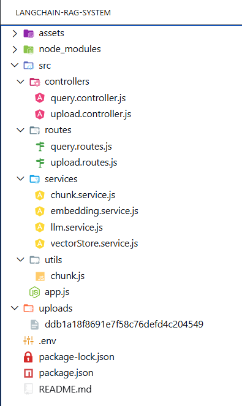
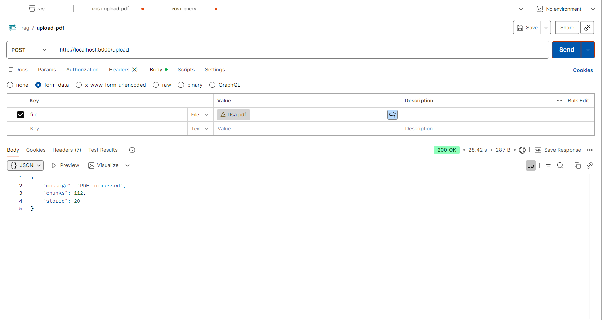
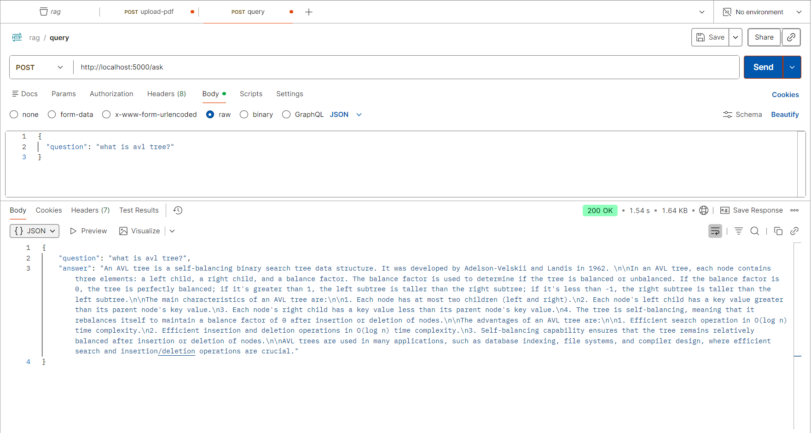

# LangChain RAG System (PDF Chatbot)

This project is a simple and practical implementation of a **Retrieval-Augmented Generation (RAG)** system using Node.js.

It allows users to upload a PDF file and ask questions based only on the content of that document. The system retrieves relevant parts of the document and generates answers using an AI model.

---

## What this project does

* Upload a PDF file
* Extract text from the PDF
* Convert text into embeddings (vectors)
* Store embeddings in memory
* Ask questions based on the PDF
* Get accurate answers generated using AI

The system does not rely on general knowledge. It answers only from the uploaded document.

---

## How it works

The system follows a simple pipeline:

1. **Upload PDF**

   * File is uploaded using Multer
   * Stored temporarily in the `uploads` folder

2. **Text Extraction**

   * PDF is parsed using LangChain PDFLoader

3. **Chunking**

   * Text is divided into smaller parts for better processing

4. **Embeddings**

   * Each chunk is converted into a vector using HuggingFace API

5. **Storage**

   * Vectors are stored in an in-memory array (vector store)

6. **Question Answering**

   * User question is converted into embedding
   * Similar chunks are retrieved using cosine similarity
   * AI model generates answer using those chunks

---

## Tech Stack

* Node.js
* Express.js
* LangChain (PDF Loader)
* HuggingFace API (Embeddings)
* Groq API (LLM)
* Multer (File Upload)

---

## Project Structure



---

## Project Demo

### Upload PDF



---

### Ask Question



---

## API Endpoints

### Upload PDF

POST `/upload`

* Body: form-data
* Key: `file`

---

### Ask Question

POST `/ask`

```json id="askjson"
{
  "question": "what is avl tree?"
}
```

---

## Example Response

```json id="respjson"
{
  "question": "what is avl tree?",
  "answer": "An AVL tree is a type of binary search tree that keeps itself balanced automatically..."
}
```

---

## Setup Instructions

1. Clone the repository

```bash id="clonecmd"
git clone <your-repo-url>
cd langchain-rag-system
```

2. Install dependencies

```bash id="installcmd"
npm install
```

3. Add environment variables

Create a `.env` file:

```env id="envfile"
GROQ_API_KEY=your_groq_api_key
HF_API_KEY=your_huggingface_api_key
```

4. Run the server

```bash id="runcmd"
npm run dev
```

---

## Key Concepts Covered

* Retrieval-Augmented Generation (RAG)
* Embeddings and vector similarity
* Cosine similarity search
* PDF parsing and chunking
* Connecting LLM with custom data

---

## Limitations

* Uses in-memory vector store (data is lost after restart)
* Limited number of chunks processed for performance
* No frontend UI

---

## Future Improvements

* Use a real vector database (Chroma / Pinecone)
* Add frontend interface (React / Next.js)
* Improve chunking strategy
* Support multiple PDF uploads
* Add caching and optimization

---

## Author

Rajesh Kayal
GenAI Full Stack Developer

---

## Summary

This project demonstrates how to build a real-world AI application using a clean backend structure.
The focus is on understanding how data flows from document to answer using embeddings and retrieval.

The code is intentionally kept simple so it is easy to understand, explain, and extend.
